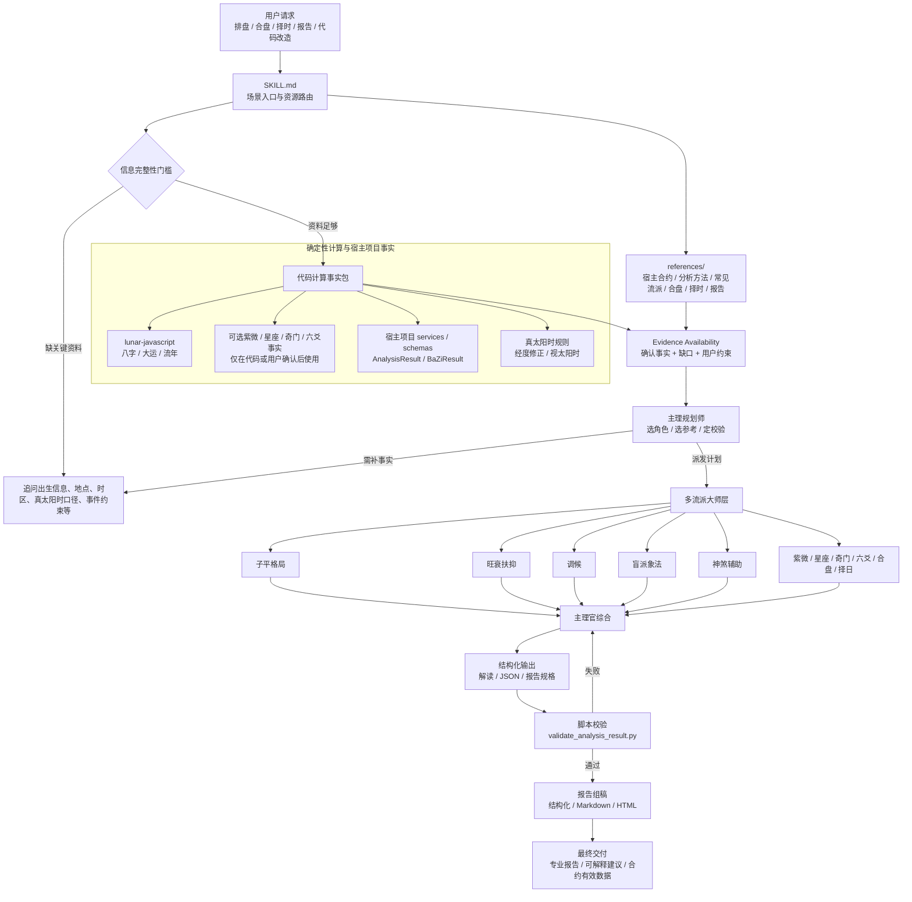

# bazi-skill: 八字排盘、紫微斗数、星座合参、奇门六爻、合盘与择日择时 Skill

主打一个：用最科学的方式，做最不科学的事情。

**网页版 / Web App**: [dockon.de](https://dockon.de)  
**GitHub**: [xuemian168/bazi-skill](https://github.com/xuemian168/bazi-skill)

`bazi-skill` 是一套可复用的 Codex / Claude Code Skill，用于八字排盘、四柱命理、真太阳时、可选紫微斗数事实、可选西洋占星/星座事实、可选纳音/刑冲合害/奇门遁甲/六爻事实、运势 K-line JSON、合盘合婚、择日择时和专业命理报告工作流。紫微、星座/占星、奇门和六爻等事实只有在代码已计算或用户提供确认盘/卦时才能使用；当前不提供 PDF 导出能力。

关键词：八字排盘、四柱、紫微斗数、星座、西洋占星、现代占星、传统占星、纳音、刑冲合害、奇门遁甲、六爻、真太阳时、合盘、合婚、择日、择时、吉日吉时、Codex Skill、Claude Code Skill、BaZi、Zi Wei Dou Shu、Qi Men Dun Jia、Liu Yao、Western astrology、zodiac signs、natal chart、synastry、Chinese astrology、true solar time。

运行入口仍然是 `SKILL.md`。本 README 只作为人读版说明，方便快速了解这个 skill 能做什么、有哪些约束、以及常用命令在哪里。

## 安装方式

仓库地址：`https://github.com/xuemian168/bazi-skill.git`

### 安装到 Codex

Codex 会从 `${CODEX_HOME:-$HOME/.codex}/skills` 发现本地 skill：

```bash
mkdir -p "${CODEX_HOME:-$HOME/.codex}/skills"
git clone https://github.com/xuemian168/bazi-skill.git "${CODEX_HOME:-$HOME/.codex}/skills/bazi-skill"
```

如果已经下载到本地，也可以直接复制：

```bash
mkdir -p "${CODEX_HOME:-$HOME/.codex}/skills"
cp -R /path/to/bazi-skill "${CODEX_HOME:-$HOME/.codex}/skills/bazi-skill"
```

安装后开启新的 Codex 会话，直接用自然语言提出八字、合盘、择日择时、K-line JSON 或报告相关需求即可触发。

### 安装到 Claude Code

在宿主项目根目录运行：

```bash
mkdir -p .claude/skills
git clone https://github.com/xuemian168/bazi-skill.git .claude/skills/bazi-skill
```

安装后在 Claude Code 中使用：

```text
/bazi-skill
```

### 更新

```bash
cd "${CODEX_HOME:-$HOME/.codex}/skills/bazi-skill"
git pull
```

Claude Code 项目级安装则在宿主项目中运行：

```bash
cd .claude/skills/bazi-skill
git pull
```

### 验证安装

确认入口文件存在：

```bash
test -f "${CODEX_HOME:-$HOME/.codex}/skills/bazi-skill/SKILL.md" && echo "Codex skill installed"
test -f ".claude/skills/bazi-skill/SKILL.md" && echo "Claude Code skill installed"
```

如本机已有 Codex 的 `skill-creator` 系统脚本，可进一步校验 skill 格式：

```bash
python3 "${CODEX_HOME:-$HOME/.codex}/skills/.system/skill-creator/scripts/quick_validate.py" "${CODEX_HOME:-$HOME/.codex}/skills/bazi-skill"
```

## 架构图



## 核心原则

- 代码排盘，AI 只解读：八字四柱、大运、流年、紫微盘、西洋占星星盘/星座/相位、纳音、刑冲合害关系、奇门盘、六爻卦象、合盘关系、吉时干支等事实必须由宿主项目代码或确定性脚本计算，不能由 AI 口算或重算。
- 确认盘为真：一旦用户确认或代码输出了命盘事实，后续解释和报告都必须以这些事实为准。
- 信息先补齐：出生信息、地点/时区、真太阳时口径、合盘双方资料、择时时间范围等关键输入缺失时，先追问，不直接猜。
- 多流派会诊：复杂命理任务先由“主理规划师”选择角色、参考和校验步骤，再让多个主流流派“大师”分别解读，最后由“主理官”综合输出，避免简单拼接或平均分。
- 结构先验证：`AnalysisResult`、报告 JSON 等结构化结果必须先通过脚本校验，再视为可交付。

## 主要能力

- 八字、紫微与星座流程：八字默认围绕 `lunar-javascript` 或宿主项目已有确定性实现；紫微、西洋占星、奇门、六爻必须先确认 repo 中已有确定性实现或用户已提供确认盘/卦，不能假设存在 `ziweiService.ts`、astrology service、qimen service 或 liuyao service。
- 真太阳时处理：区分宿主项目的经度修正口径与更严格的视太阳时口径，并处理时辰边界风险。
- 运势 K-line JSON：生成、修复、审查符合宿主项目 `AnalysisResult` 合约的 100 年时间线数据。
- 多流派大师会诊：先由主理规划师决定是否调用子平格局、旺衰扶抑、调候、盲派象法、刑冲合害、神煞辅助、纳音、紫微、现代/传统西洋占星、奇门、六爻、择日、合盘等角色，最终由主理官综合。
- 合盘与合婚：对双方命盘进行关系动力、互补点、冲突点、阶段节奏和注意事项分析。
- 吉日吉时：按事件类型、候选日期、地点时区和硬性限制，输出可解释的择日择时排序。
- 一事一问：在已有奇门盘或六爻卦象时，对投稿、签约、合作、面试等具体问题做证据化解读。
- 专业报告：从已验证 JSON 或报告规格生成结构化、Markdown 或 HTML 风格的中文报告；当前不生成 PDF。

## 输出案例

以下案例均使用**随机虚构样本**（非真人），仅作输出形态示意。命盘事实由 `lunar-javascript` 确定性计算，与宿主项目 `baziService.ts` 同口径；面向用户的解读统一为文化分析与反思建议，非确定性医疗/法律/金融结论。

### 案例 1：排盘 + 速读

**输入**：女命 · 1981-01-14 01:01（公历）· 重庆（东经 106.55°）

**输出（确认命盘事实）**

| 项目 | 内容 |
|---|---|
| 真太阳时（旧版经度校正） | (106.55−120)×4 = −53.8 分 → 1981-01-14 **00:07:12**（子时，距柱变边界约 53 分、非临界） |
| 农历 | 一九八〇年腊月初九 |

| 柱 | 年 | 月 | 日 | 时 |
|---|---|---|---|---|
| 干支 | 庚申 | 己丑 | **壬辰**(日主壬) | 庚子 |

大运（女命阳年逆排，起运虚岁 2）：戊子 · 丁亥 · 丙戌 · 乙酉 · **甲申(当前)** · 癸未 · 壬午 · 辛巳 · 庚辰

> **速读**：壬水生丑月（季冬），申子辰三合水局 + 重金生身 → **身旺、金寒水冷**；全局**火（财）全无、木（食伤）极弱**。用神方向取火、木暖局疏秀，忌再添金水。年柱为庚申（1980）而非 1981，因八字以立春换岁——库已正确处理。

### 案例 2：多流派大师会诊（主理官综合，节选）

对上盘触发「多流派大师会诊」：并行派发 **子平格局 / 旺衰扶抑 / 调候 / 盲派象法 / 神煞辅助** 五派，各派只拿同一份证据包 + 自家流派提示词，禁止重算命盘；再经 **安全编辑** 把关，最后由 **主理官** 按源层级（代码事实 > 契约 > 方法契合度 > 跨派共识 > 单派解读）综合，不机械平均。

**跨派共识（高置信）**：身旺水寒、官印相生、缺火为纲；用神 火（财）→ 木（食伤）→ 燥土，忌金（印）、水（比劫）。

**八维方向**（方向性倾向，**非 0–100 评分**，节选）

| 维度 | 方向 | 依据 |
|---|---|---|
| 事业 | 中上 | 官印相生、身旺任官，契合体制/专业/文教/规则管理路线 |
| 财富 | 中（偏稳健） | 财星不显，成就更依赖后天努力与机遇配合；比劫旺→合作资金往来宜谨慎（风险风格，非投资建议） |
| 婚姻 | 需经营 | 夫星正官清透（正向）；夫宫合入水局、缺火暖局 → 更需用心经营，为结构倾向、非注定 |

**透明披露的分歧**：甲申运甲木「无根受冻」效力、湿土制水力度为流派内可争议项；时柱信心下调归因于真太阳时精度（未用均时差），非边界临界；神煞派自陈本项目无完整神煞引擎，仅采信「子午卯酉」，其余（文昌/贵人/驿马/华盖/空亡/纳音）一律 `evidence_gap` 不评。

### 案例 3：人生 K-line `AnalysisResult` JSON（结构示意，已截断）

K-line 输出必须为合约有效 JSON、`timeline` 恰好 100 条、OHLC 为 0–100、含涨跌两类、且仅一条 `isPeak: true`；交付前用 `scripts/validate_analysis_result.py` 校验。

```json
{
  "bazi": { "year": {"gan":"庚","zhi":"申"}, "month": {"gan":"己","zhi":"丑"},
            "day": {"gan":"壬","zhi":"辰"}, "hour": {"gan":"庚","zhi":"子"} },
  "birthYear": 1981,
  "startAge": 2,
  "daYun": ["戊子","丁亥","丙戌","乙酉","甲申","癸未","壬午","辛巳","庚辰"],
  "mainAttribute": "水",
  "overallScore": 72,
  "generalComment": "身旺水寒、官印相生，宜专业与规则路线，逢火木暖局之运渐显实利。",
  "investment": { "content": "财弱比劫旺，宜稳健；补火之年量力小试。", "rating": 3,
                  "opportunityYear": "2026", "style": "稳健" },
  "personality": { "content": "理性、学习力强、内敛深思。", "rating": 4 },
  "career":      { "content": "体制/专业/文教/规则管理契合度高。", "rating": 4 },
  "timeline": [
    { "year": 1981, "age": 1,  "open": 50, "close": 52, "high": 55, "low": 48,
      "summary": "起运前以月令小运论。", "detailedReview": "……" },
    { "year": 2026, "age": 46, "open": 58, "close": 71, "high": 74, "low": 56,
      "summary": "丙午补火，开财暖身窗口，机会与起伏并存。",
      "detailedReview": "……", "isPeak": true }
    /* … 共 100 条：year 从 birthYear 到 birthYear+99，age 1–100 … */
  ]
}
```

### 案例 4：单维度深推（婚姻/感情经营，节选）

承案例 1–2 的同一随机样本，触发「聚焦某一维度深推」。主理官先用 `lunar-javascript` 确定性算出流年干支，并标注其与**夫星（女命官杀=土）、夫宫（日支辰）、桃花（时支子）**的合冲关系，再据此综合——全程为**结构倾向 / 时机参考，非"克夫/注定"断语**。

**感情结构（节选）**：夫星正官己土透月、清而显（对象偏规矩责任型）；但夫宫辰落入申子辰水局 → 关系易受外部人际/财务牵动；印重泄官 + 全局缺火 → 关系**温度与边界需经营**。

**时机线（流年事实，节选）**

| 年 | 干支 | 十神 | 关键关系 | 性质 |
|---|---|---|---|---|
| 2026 | 丙午 | 偏财 | 子午冲·桃花动 | 财暖升温但带冲动，宜稳 |
| **2029** | **己酉** | **正官(夫星)** | **辰酉合夫宫 + 桃花** | ⭐ 正缘/关系明朗信号最强年 |
| 2030 | 庚戌 | 偏印 | 辰戌冲夫宫 | 关系/家宅易变动，宜缓决重沟通 |
| 2033–2042 | 癸未运 | — | 未含夫星根+财+暖局 | 夫星转旺、暖度回升的长线利好 |

**经营要点（节选）**：① 主动补暖（表达、陪伴、向阳暖色居所）；② 立边界、财务清晰（对治夫宫入水局、比劫旺）；③ 以"明确表达期待"替代"聚焦不足"（对治夫宫伤官）；④ 顺势择时——合夫宫/暖局之年利推进，冲刑夫宫之年宜缓决。

> 时机基于流年干支（确定性计算）；无流月/流日，不定位年内具体日期。随机虚构样本、非真人，婚姻为关系模式与时机倾向、非命定。

## 目录结构

- `SKILL.md`：Codex 运行时读取的主入口，定义触发条件、工作流、验证门槛和资源路由。
- `agents/openai.yaml`：界面展示用的名称、简介和默认提示词。
- `references/`：分主题参考文档，包括项目合约、分析方法、真太阳时、紫微、星座/西洋占星、常见流派、合盘、择时、报告生成、角色分工等。
- `references/school-prompts/`：多流派大师与主理官的专属提示词和知识切片，要求证据不足时输出 `evidence_gap`，不补空白规则。
- `scripts/validate_analysis_result.py`：校验 K-line `AnalysisResult` JSON 的确定性脚本。

## Claude Code 兼容

宿主项目内可提供 Claude Code 项目级 skill 镜像：`<repo>/.claude/skills/bazi-skill/`。

在宿主项目根目录启动 Claude Code 后，可以用 `/bazi-skill` 调用同一套八字、可选紫微事实、可选星座/西洋占星事实、可选奇门/六爻事实、合盘、择日择时、多流派大师会诊和专业报告工作流。该镜像使用项目本地 `${CLAUDE_SKILL_DIR}` 读取 `references/` 与 `scripts/`，避免依赖个人机器上的 Codex skill 安装路径。

## 常用命令

以下命令默认在 `bazi-skill` skill 目录下运行。

校验 `AnalysisResult` JSON：

```bash
python3 scripts/validate_analysis_result.py result.json
```

从标准输入校验，并显式指定出生年份：

```bash
cat result.json | python3 scripts/validate_analysis_result.py --birth-year 1990 -
```

校验整个 skill 的基础格式：

```bash
python3 "${CODEX_HOME:-$HOME/.codex}/skills/.system/skill-creator/scripts/quick_validate.py" .
```

## 使用提醒

- 面向用户的最终表达应保持“文化分析与反思建议”的定位，不做确定性医疗、法律、金融承诺。
- 报告、合盘、择日择时等输出要写清楚计算依据、适用范围、假设条件和不确定性。
- 需要改项目代码时，先读项目内相关 `CLAUDE.md` 和 touched modules；只改 skill 文档时，不应顺手改应用代码。
