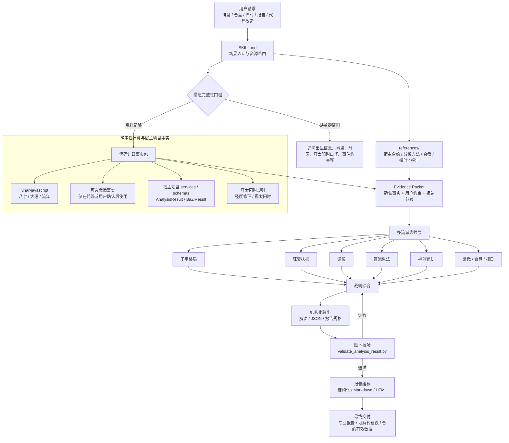

# bazi-skill 中文说明

`bazi-skill` 是一套可复用的 Codex / Claude Code Skill，用于把八字、可选紫微事实、运势 K-line JSON、合盘、择日择时和专业报告流程串成一套可执行工作流。紫微事实只有在代码已计算或用户提供确认盘时才能使用；当前不提供 PDF 导出能力。

运行入口仍然是 `SKILL.md`。本 README 只作为人读版说明，方便快速了解这个 skill 能做什么、有哪些约束、以及常用命令在哪里。

## 安装方式

仓库地址：`https://github.com/xuemian168/bazi-skill.git`

### 安装到 Codex

Codex 会从 `${CODEX_HOME:-$HOME/.codex}/skills` 发现本地 skill：

```bash
mkdir -p "${CODEX_HOME:-$HOME/.codex}/skills"
git clone https://github.com/xuemian168/bazi-skill.git "${CODEX_HOME:-$HOME/.codex}/skills/bazi-skill"
```

如果已经下载到本地，也可以直接复制：

```bash
mkdir -p "${CODEX_HOME:-$HOME/.codex}/skills"
cp -R /path/to/bazi-skill "${CODEX_HOME:-$HOME/.codex}/skills/bazi-skill"
```

安装后开启新的 Codex 会话，直接用自然语言提出八字、合盘、择日择时、K-line JSON 或报告相关需求即可触发。

### 安装到 Claude Code

在宿主项目根目录运行：

```bash
mkdir -p .claude/skills
git clone https://github.com/xuemian168/bazi-skill.git .claude/skills/bazi-skill
```

安装后在 Claude Code 中使用：

```text
/bazi-skill
```

### 更新

```bash
cd "${CODEX_HOME:-$HOME/.codex}/skills/bazi-skill"
git pull
```

Claude Code 项目级安装则在宿主项目中运行：

```bash
cd .claude/skills/bazi-skill
git pull
```

### 验证安装

确认入口文件存在：

```bash
test -f "${CODEX_HOME:-$HOME/.codex}/skills/bazi-skill/SKILL.md" && echo "Codex skill installed"
test -f ".claude/skills/bazi-skill/SKILL.md" && echo "Claude Code skill installed"
```

如本机已有 Codex 的 `skill-creator` 系统脚本，可进一步校验 skill 格式：

```bash
python3 "${CODEX_HOME:-$HOME/.codex}/skills/.system/skill-creator/scripts/quick_validate.py" "${CODEX_HOME:-$HOME/.codex}/skills/bazi-skill"
```

## 架构图



## 核心原则

- 代码排盘，AI 只解读：八字四柱、大运、流年、紫微盘、合盘关系、吉时干支等事实必须由宿主项目代码或确定性脚本计算，不能由 AI 口算或重算。
- 确认盘为真：一旦用户确认或代码输出了命盘事实，后续解释和报告都必须以这些事实为准。
- 信息先补齐：出生信息、地点/时区、真太阳时口径、合盘双方资料、择时时间范围等关键输入缺失时，先追问，不直接猜。
- 多流派会诊：复杂命理任务可用多个主流流派的“大师”分别解读，再由“裁判”综合输出，避免简单拼接或平均分。
- 结构先验证：`AnalysisResult`、报告 JSON 等结构化结果必须先通过脚本校验，再视为可交付。

## 主要能力

- 八字与紫微流程：八字默认围绕 `lunar-javascript` 或宿主项目已有确定性实现；紫微必须先确认 repo 中已有确定性实现或用户已提供确认盘，不能假设存在 `ziweiService.ts`。
- 真太阳时处理：区分宿主项目的经度修正口径与更严格的视太阳时口径，并处理时辰边界风险。
- 运势 K-line JSON：生成、修复、审查符合宿主项目 `AnalysisResult` 合约的 100 年时间线数据。
- 多流派大师会诊：支持子平格局、旺衰扶抑、调候、盲派象法、神煞辅助、紫微、择日、合盘等角色分工，最终由裁判综合。
- 合盘与合婚：对双方命盘进行关系动力、互补点、冲突点、阶段节奏和注意事项分析。
- 吉日吉时：按事件类型、候选日期、地点时区和硬性限制，输出可解释的择日择时排序。
- 专业报告：从已验证 JSON 或报告规格生成结构化、Markdown 或 HTML 风格的中文报告；当前不生成 PDF。

## 目录结构

- `SKILL.md`：Codex 运行时读取的主入口，定义触发条件、工作流、验证门槛和资源路由。
- `agents/openai.yaml`：界面展示用的名称、简介和默认提示词。
- `references/`：分主题参考文档，包括项目合约、分析方法、真太阳时、合盘、择时、报告生成、角色分工等。
- `references/school-prompts/`：多流派大师与裁判的专属提示词和知识切片，要求证据不足时输出 `evidence_gap`，不补空白规则。
- `scripts/validate_analysis_result.py`：校验 K-line `AnalysisResult` JSON 的确定性脚本。

## Claude Code 兼容

宿主项目内可提供 Claude Code 项目级 skill 镜像：`<repo>/.claude/skills/bazi-skill/`。

在宿主项目根目录启动 Claude Code 后，可以用 `/bazi-skill` 调用同一套八字、可选紫微事实、合盘、择日择时、多流派大师会诊和专业报告工作流。该镜像使用项目本地 `${CLAUDE_SKILL_DIR}` 读取 `references/` 与 `scripts/`，避免依赖个人机器上的 Codex skill 安装路径。

## 常用命令

以下命令默认在 `bazi-skill` skill 目录下运行。

校验 `AnalysisResult` JSON：

```bash
python3 scripts/validate_analysis_result.py result.json
```

从标准输入校验，并显式指定出生年份：

```bash
cat result.json | python3 scripts/validate_analysis_result.py --birth-year 1990 -
```

校验整个 skill 的基础格式：

```bash
python3 "${CODEX_HOME:-$HOME/.codex}/skills/.system/skill-creator/scripts/quick_validate.py" .
```

## 使用提醒

- 面向用户的最终表达应保持“文化分析与反思建议”的定位，不做确定性医疗、法律、金融承诺。
- 报告、合盘、择日择时等输出要写清楚计算依据、适用范围、假设条件和不确定性。
- 需要改项目代码时，先读项目内相关 `CLAUDE.md` 和 touched modules；只改 skill 文档时，不应顺手改应用代码。
